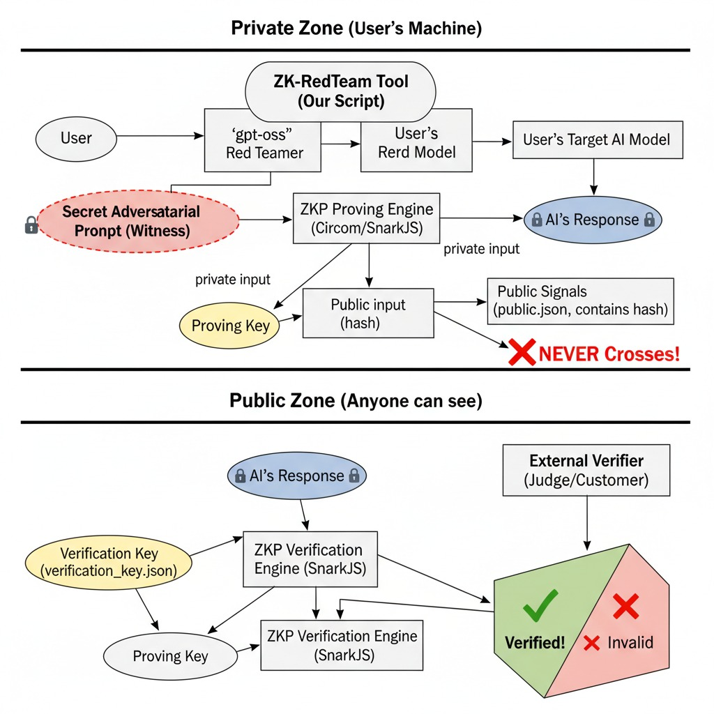

# ZK-RedTeam: A Verifiable & Private AI Safety Auditing System

**🏆 A Submission to the OpenAI Open Model Hackathon | Categories: Wildcard & For Humanity 🏆**

ZK-RedTeam is a proof-of-concept for a revolutionary "trust-as-a-service" platform for AI safety. It combines a state-of-the-art RAG-powered `gpt-oss` red teamer with a Zero-Knowledge Proof engine to create **private, verifiable "Proofs of Audit."**

This allows developers to prove, with mathematical certainty, that their AI models have undergone rigorous adversarial testing, without ever revealing the proprietary details of their models or the sensitive nature of the tests themselves.



---

## The Problem: The Trust Deficit in AI Safety

As AI models become more powerful, how can we trust that they are safe? Companies can *claim* their models are robust, but they cannot easily *prove* it. The auditing process is a black box. This project solves that problem.

Our journey led us to a key discovery: the base `gpt-oss` model is so well-aligned that it resists generating adversarial content. We had to develop a sophisticated, multi-step RAG pipeline to jailbreak the jailbreaker, demonstrating a critical vulnerability class. ZK-RedTeam is not just a tool; it's a demonstration of *why* verifiable auditing is so essential.

## How It Works: The "Cloud AI + Local Prover" Architecture

Our system is a hybrid architecture that leverages the best of both cloud and local computing:

1.  **AI Red Teamer (Cloud/Kaggle GPU):**
    *   **Embed & Store:** A "Case Bank" of 140+ expert adversarial prompts is vectorized and stored in a MongoDB Atlas vector database, creating a long-term memory.
    *   **Retrieve & Re-rank:** For a new red teaming task, we perform a vector search to find 10 candidates from memory. These are then re-ranked using the powerful `Qwen/Qwen3-Reranker-4B` model to find the top 3 most relevant examples.
    *   **Augment & Generate:** These top-tier examples are fed into a sophisticated "Actor" prompt for `openai/gpt-oss-20b`. This generates a new, unique adversarial prompt (the "secret witness").

2.  **ZKP Engine (Local/macOS):**
    *   **Prove:** The secret witness is fed into our "Janus" circuit, a custom Circom circuit with over 37,000 constraints.
    *   **Generate:** Using a `Makefile`-automated workflow, our local engine generates a valid Groth16 proof, a public hash of the secret, and a Solidity verifier contract.

3.  **Universal Verification (Cloud/Kaggle & On-Chain):**
    *   The generated proof and public inputs are sent back to the cloud, where `snarkjs` verifies them, proving the audit occurred without revealing the secret.
    *   The generated `Janus_Verifier.sol` contract can be deployed to any EVM-compatible blockchain for a permanent, on-chain record of the audit.

## Getting Started: The ZKP Engine (`circom-scaffold`)

This repository contains the core ZKP engine.

### Prerequisites

-   [Node.js](https://nodejs.org/) & [pnpm](https://pnpm.io/installation)
-   [Foundry](https://book.getfoundry.sh/getting-started/installation) for smart contract development.
-   **Rust & Cargo**: `curl --proto '=https' --tlsv1.2 -sSf https://sh.rustup.rs | sh`
-   **Circom Compiler**: `cargo install circom`


### Installation

1.  **Clone the repository:**
    ```bash
    git clone https://github.com/surfiniaburger/ZK-RedTeam.git
    cd ZK-RedTeam/circom-scaffold
    ```

2.  **Install Node.js dependencies:**
    ```bash
    pnpm install
    ```

3.  **Download the Powers of Tau file:**
    The Janus circuit is large and requires a Powers of Tau ceremony file of at least power 16.
    ```bash
    mkdir -p power-of-tau
    wget https://storage.googleapis.com/zkevm/ptau/powersOfTau28_hez_final_16.ptau -O power-of-tau/pot16_final.ptau
    ```

### Configuration

1.  **Set the Circuit Name:**
    Copy `.env.example` to `.env` and set the following variables:
    ```
    CIRCUIT_NAME=Janus
    POWER_OF_TAU=16
    ```
    *(Note: Our main circuit file is located at `circuits/Janus.circom`)* similarly proof_of_prompt.circom

2.  **Set Your Private Input:**
    Open `scripts-circom/main.js` and replace the placeholder `promptString` with the secret you want to prove knowledge of.

### Usage

The entire ZKP and smart contract workflow is automated. After cloning and running `pnpm install`, you just need to:

1.  **Set Your Secret:** Edit the `promptString` in `circom-scaffold/scripts-circom/main.js`.
2.  **Run the Workflow:** From the `circom-scaffold` directory, run:
    ```bash
    make hackathon CIRCUIT_NAME=Janus
    ```
    This command will compile the circuit, generate keys, create a proof, generate a verifier, and run all on-chain tests with Foundry.
3.  **Create the Asset Bundle:** Create the zip file containing the essential verification assets.
    ```bash
    zip zk_verifier_assets.zip outputs/keys/Janus_verification_key.json outputs/Janus_js/Janus.wasm
    ```

#### **Step 2: On Kaggle - Assemble the Final Demo Notebook**

1.  **Upload Your Dataset:** Go to your Kaggle notebook. If you already have a `zk-redteam-verifier-assets` dataset, create a **new version** of it and upload your new `zk_verifier_assets.zip` file. If not, create it now.
2.  **Update Your Notebook:** Use the final, definitive cells I provided.
    *   **The RAG Pipeline Cell:** This is the one that just ran successfully. Keep it.
    *   **The "Handoff" Markdown Cell:** Explain the architecture.
    *   **The "Pre-Computed Proof" Cell:** After your `make hackathon` command finishes on your Mac, open `outputs/verify/Janus_proof.json` and `outputs/verify/Janus_public.json`. Copy their contents and paste them into this cell in your notebook.
    *   **The "Verification" Cell:** Use the final version that reads from the Kaggle dataset.

3.  **Run "Save Version":** In the top right of your Kaggle notebook, click "Save Version" and choose "Save & Run All (Commit)". This will run your entire notebook from top to bottom and create a clean, shareable, and verifiable result for the judges.


## The Demo Notebook (`zk-redteamer.ipynb`)

Our main demonstration is in the `zk-redteamer.ipynb` file, which is designed to be run on Kaggle or Google Colab. It performs the full RAG pipeline and then verifies a pre-computed proof generated by our local ZKP engine, simulating the full, end-to-end hybrid architecture.

---

## License

This project is licensed under the MIT License.